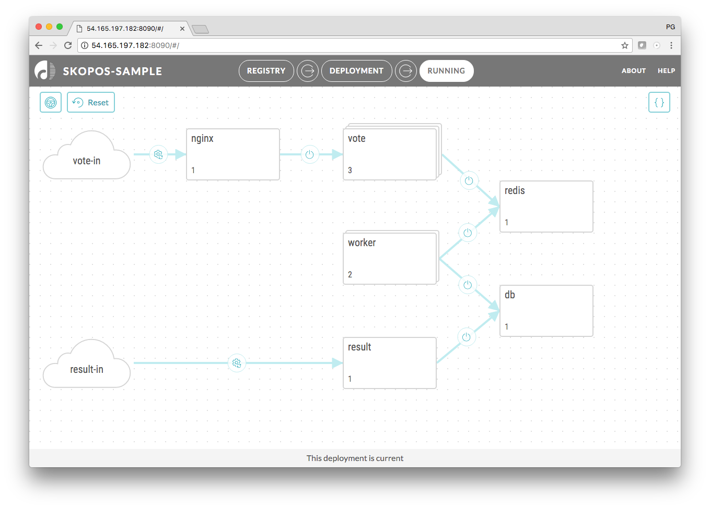

[](https://gitter.im/datagridsys/skopos?utm_source=badge&utm_medium=badge&utm_campaign=pr-badge&utm_content=badge)

Skopos Continuous Deployment System for Containers
===========================
Before you get started, [read this short blog](http://datagridsys.com/2017/04/18/introducing-skopos/) on what Skopos is and what it does. 

Below you will find a sample application along with a copy of the [Skopos Continuous Deployment System](http://datagridsys.com/skopos/). The instructions share how to download and install both Skopos and the demo app so that you can try out our system. If you want to try out Skopos with your own app, check out our [Getting Started Guide](http://skopos-beta.datagridsys.com/).

Sample Skopos application
===========================

This is a sample containerized application that can be deployed and upgraded with [Skopos](http://skopos-beta.datagridsys.com/).

The application in question exposes two web interfaces - one that allows votes to be cast and one that shows results. The example below can be used as a guide on how to deploy, upgrade (to a version with modified UI) and tear-down this sample application.



### Download Skopos image

```
docker pull datagridsys/skopos:beta
```

### Download and Install Skopos CLI
The CLI is a thin wrapper on top of the Skopos REST API. The CLI does not need to run on the same host as Skopos, it can be run on any host with network access to the Skopos engine.

The `sks-ctl` utility is a self-contained executable available for the following operating systems:

* Linux: [https://s3.amazonaws.com/get-skopos/beta/linux/sks-ctl](https://s3.amazonaws.com/get-skopos/beta/linux/sks-ctl)
* OS X: [https://s3.amazonaws.com/get-skopos/beta/darwin/sks-ctl](https://s3.amazonaws.com/get-skopos/beta/darwin/sks-ctl)
* Windows: [https://s3.amazonaws.com/get-skopos/beta/windows/sks-ctl.exe](https://s3.amazonaws.com/get-skopos/beta/windows/sks-ctl.exe)

To download and install on Linux:

```
wget https://s3.amazonaws.com/get-skopos/beta/linux/sks-ctl
chmod +x sks-ctl
mkdir -p ~/bin
mv sks-ctl ~/bin
```

### Clone this repository
We will need the application model, environment file and same sample scripts which we are using in our model in order to hook up into various stages of the deploy.

```
git clone https://github.com/datagridsys/skopos-sample-app.git
```


### Start Skopos engine

Start the Skopos container, passing it the docker socket (so it can manage containers) and the user scripts from this repository. These are sample scripts that illustrate how to hook external systems (i.e. monitoring, release/bug tracking, etc.)  systems into your deploy process.

```
cd skopos-sample-app
docker run -d -p 8090:80 --restart=unless-stopped --name skopos   \
    -v /var/run/docker.sock:/var/run/docker.sock                  \
    -v $(pwd)/scripts:/skopos/user/bin/         \
    datagridsys/skopos:beta
```

### Load model for initial deploy

```
~/bin/sks-ctl load -bind my-ip-or-host:8090 -project skopos-sample -env env.yaml model-v1.yaml
```
Note: replace `my-ip-or-host` with the actual host or IP address where Skopos runs.


### Open Skopos GUI
It is available on port 8090 on the host where you are running the container. Review the model - it shows in blue the components that will change during the deploy.

You can switch the to plan (icon in upper right corner) to view the generated plan for this particular deploy. The plan shows the top level of steps to be run (one for each component plus pre- and post- flight steps). The plan would take into consideration any dependencies between components and upgrade them in the correct order. Each of the top level steps can be expanded to view the set of steps that will be performed for each component. The outcome of each step can trigger either the next step (on success) or a rollback to the previous version (on failure).


Some of the steps are inserted based on [lifecycle](http://skopos-beta.datagridsys.com/LIFECYCLE-REF/#application-lifecycle) events that were defined in the model file - this allows us to insert our own scripts to be executed at certain places in the plan:


### Run deploy
Either from the GUI or from CLI. The initial deploy may take a few minutes since container images will need to be downloaded.

```
~/bin/sks-ctl start -bind my-ip-or-host:8090
```

Note: replace `my-ip-or-host` with the actual host or IP address where Skopos runs.

After the deploy, the web interface exposed by the sample application would be available at:

* Vote: http://my-ip-or-host:8880/
* Result: http://my-ip-or-host:8881/

### Upgrade to a new version
This repository contains a second model, where the versions of two of the components - result and vote - are updated to 2.0. You can load the new model with the command below. Skopos would generate a plan for getting from the current state (v1.0) to the desired state as described in the model (v2.0 of vote and result components).


```
~/bin/sks-ctl load -bind my-ip-or-host:8090 -project skopos-sample -env env.yaml model-v2.yaml
```

Note: replace `my-ip-or-host` with the actual host or IP address where Skopos runs.

Review the new plan in UI. Notice how, unlike the initial deploy, it only changes two components and instead of a deploy it does a rolling upgrade, making sure each component stays responsive during the operation.

To start the deploy, use the GUI or the CLI as described above. If you open the result and vote web interfaces during the upgrade you will see how some requests are served by the old version and some are served by the new version, but the application is never inaccessible.


### Tear down the application
If you want to remove all containers for our sample application, run the following command. This example loads and starts the deploy in a single command. Progress can be still viewed in the Skopos UI (or over the API).

```
~/bin/sks-ctl run -bind my-ip-or-host:8090 -mode teardown -project skopos-sample -env env.yaml model-v2.yaml
```

Note: replace `my-ip-or-host` with the actual host or IP address where Skopos runs.

## Next steps

Now that you have deployed your first - and second - application with Skopos, here are a few things you can try next:

- Set up [continuous deployment with Skopos Auto-Pilot or Jenkins CI/CD](http://skopos-beta.datagridsys.com/CICD/)
- Add [chatops with Slack](http://skopos-beta.datagridsys.com/CHATOPS/)
- See some of the [standard deployment environments](http://skopos-beta.datagridsys.com/TED-GUIDE/#standard-target-environment-files) Skopos supports

... or just look at the full [Skopos Documentation](http://skopos-beta.datagridsys.com/).

You can also reach out to us on [Gitter](https://gitter.im/datagridsys/skopos) or by [email](mailto:support@datagridsys.com).
