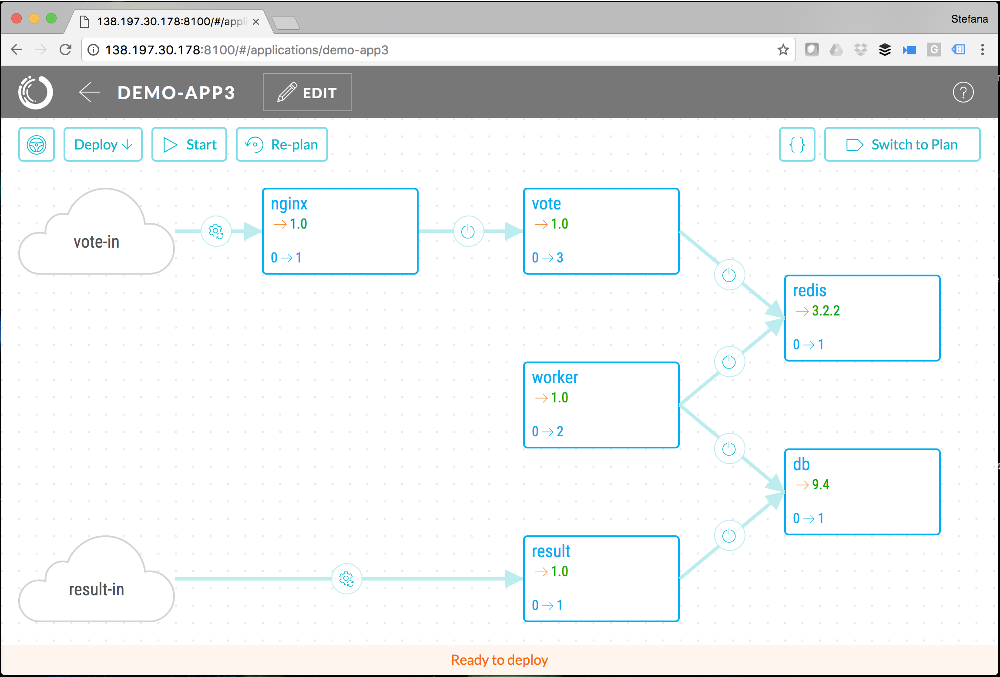
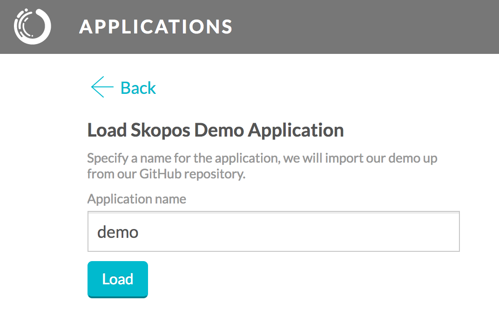
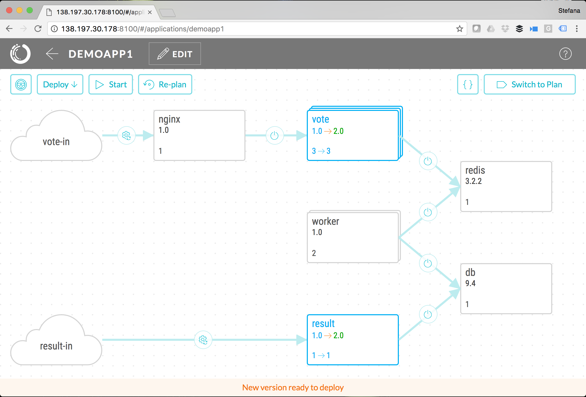
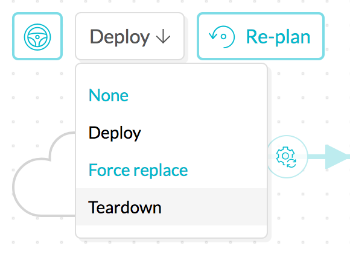

[](https://gitter.im/opsani/skopos?utm_source=badge&utm_medium=badge&utm_campaign=pr-badge&utm_content=badge)

Skopos Continuous Deployment System
==========================
[Skopos™](http://opsani.com/skopos/) is a modern continuous deployment system for container-based services, especially for DevOps teams and those using microservice architectures.  Skopos consists of two components:

* The _Skopos engine_, packaged in a single container for simple installation
* The _Skopos control utility_ - a command line utility `skopos`, available for Linux, Mac OS and Windows. This utility may run on the same host where the Skopos engine runs or anywhere else with network access to that host.

Below you can find a sample application and instructions for starting Skopos and deploying this sample app.  If you want to try out Skopos with your own app, check out our [Getting Started Guide](http://doc.opsani.com/skopos/edge/README/).

Skopos Sample Application
===========================

This Skopos sample application is a scalable variant of the Docker example Pet Voting Application which deploys to Docker (single host).  The application exposes two web interfaces - one that allows votes to be cast and one that shows results.  The example below can be used as a guide on how to deploy, upgrade (to a version with modified UI), and tear-down this sample application.



### Download and Install Skopos CLI

The `skopos` command line utility, or CLI, is a thin wrapper on top of the Skopos REST API.  This self-contained executable is available for the following operating systems:

    Linux: https://s3.amazonaws.com/get-skopos/edge/linux/skopos
    OS X: https://s3.amazonaws.com/get-skopos/edge/darwin/skopos
    Windows: https://s3.amazonaws.com/get-skopos/edge/windows/skopos.exe

To download and install on Linux:

```
wget https://s3.amazonaws.com/get-skopos/edge/linux/skopos
chmod +x skopos
mkdir -p ~/bin
mv skopos ~/bin
```

>The `~/bin` directory used above is writeable even without root privileges. If
>you have root privileges, you may prefer to install `skopos` in the
>`/usr/local/bin` directory instead.

### Clone this repository

We will need the application model, environment file and some sample scripts which we are using in our model in order to hook up into various stages of the deploy.

```
git clone https://github.com/opsani/skopos-sample-app.git
```

### Download/Run Skopos image

```

cd skopos-sample-app
docker run -d -p 8100:8100 --restart=unless-stopped --name skopos   \
    -v /var/run/docker.sock:/var/run/docker.sock                  \
    -v $(pwd)/scripts:/skopos/user/bin/         \
    opsani/skopos:edge
    
```

### Open The Skopos UI
Open your browser to ```http://localhost:8100``` 

Note: replace `localhost` with the actual host or IP address where Skopos runs.


Click the ```Use Our Demo App``` option.
Name your demo app `skopos-sample` and click ```Load```.



### Open the Demo App

In the Skopos UI, click on your demo app name to view the model (architecture). The blue components are those that will change during the deploy.


Click ```Switch to Plan``` (button in the upper right corner) to view the generated deployment plan for this particular application. The plan shows the top level of steps to be run (one for each component plus pre- and post- flight steps). The plan would take into consideration any dependencies between components and upgrade them in the correct order. Each of the top level steps can be expanded to view the set of steps that will be performed for each component. The outcome of each step can trigger either the next step (on success) or a rollback to the previous version (on failure).

### Run deploy

Click the start button to Deploy the demo app. The initial deploy may take a few minutes since container images will need to be downloaded. 

Once deployed, the demo app will be running here:

* Vote: http://localhost:8880/
* Result: http://localhost:8881/

Note: replace `localhost` with the actual host or IP address where Skopos runs.

### Upgrade to a new version
This repository contains a second model, where the versions of two of the components - result and vote - are updated to 2.0. You can load the new model with the command below. Skopos would generate a plan for getting from the current state (v1.0) to the desired state as described in the model (v2.0 of vote and result components).

```
~/bin/skopos load -bind localhost:8100 -project skopos-sample -env env.yaml model-v2.yaml
```

Note: replace `localhost` with the actual host or IP address where Skopos runs.

Review the new plan in UI. Notice how, unlike the initial deploy, it only changes two components and instead of a deploy it does a rolling upgrade, making sure each component stays responsive during the operation.



Click the start button to Deploy the update to the demo app. If you open the result and vote web interfaces during the upgrade you will see how some requests are served by the old version and some are served by the new version, but the application is never inaccessible.

* Vote: http://localhost:8880/
* Result: http://localhost:8881/

Note: replace `localhost` with the actual host or IP address where Skopos runs.

### Tear down the application
If you want to remove all containers for our sample application, use the `Teardown` option in the UI by selecting the action button drop down and then selecting `teardown`. Next select start to run the teardown steps.



or run the following command:

```
~/bin/skopos run -bind localhost:8100 -mode teardown -project skopos-sample -env env.yaml model-v2.yaml
```

Note: replace `localhost` with the actual host or IP address where Skopos runs.

### Next steps

Now that you have deployed your first - and second - application with Skopos, here are a few things you can try next:

Set up [continuous deployment with Skopos Auto-Pilot or Jenkins CI/CD](http://doc.opsani.com/skopos/edge/CICD/)

Add [chatops with Slack](http://doc.opsani.com/skopos/edge/CHATOPS/)

See some of the [standard deployment environments](http://doc.opsani.com/skopos/edge/TED-GUIDE/#standard-target-environment-files) Skopos supports

... or just look at the [full Skopos Documentation](http://doc.opsani.com/skopos/edge).

You can also reach out to us on [Gitter](https://gitter.im/opsani/skopos).
